[](https://classroom.github.com/a/XoLGRbHq)
[](https://classroom.github.com/online_ide?assignment_repo_id=15322201&assignment_repo_type=AssignmentRepo)
# SE-Assignment-5
Installation and Navigation of Visual Studio Code (VS Code)
 Instructions:
Answer the following questions based on your understanding of the installation and navigation of Visual Studio Code (VS Code). Provide detailed explanations and examples where appropriate.

 Questions:

1. Installation of VS Code:
   - Describe the steps to download and install Visual Studio Code on Windows 11 operating system. Include any prerequisites that might be needed.

   Visual Studio Code (VS Code)  is a free, open-source code editor developed by Microsoft. It supports various programming languages and is highly customizable through extensions.

Step-by-Step Installation on Windows

1. Download VS Code
   - Visit the official [VS Code website](https://code.visualstudio.com/).
   - Click on the "Download for Windows" button.

2. Run the Installer
   - Open the downloaded file (`VSCodeUserSetup-x64-1.56.2.exe` or similar).
   - Follow the installation wizard:
     - Accept the license agreement.
     - Choose the installation location (the default is usually fine).
     - Select additional tasks (e.g., create a desktop icon, add to PATH).

3. Launch VS Code
   - Once the installation is complete, click "Finish" to launch VS Code.
   - You can also open it from the Start menu or the desktop icon.

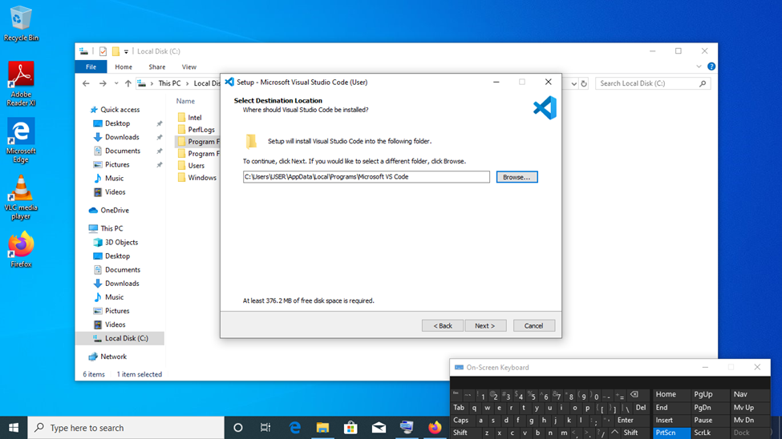

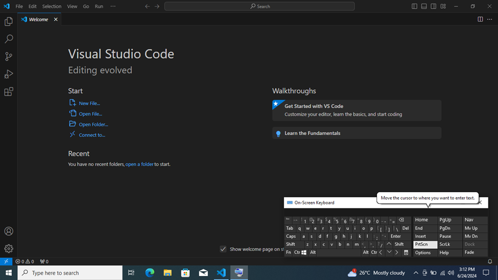

2. First-time Setup:
   - After installing VS Code, what initial configurations and settings should be adjusted for an optimal coding environment? Mention any important settings or extensions.

   After installing Visual Studio Code, you can optimize it for an efficient coding environment by adjusting various settings and configurations. Here are the steps to set up VS Code for an optimal development experience:

1. Install Essential Extensions

- Python (by Microsoft): Provides support for Python development.
- Pylance (by Microsoft): Enhances the Python extension with better IntelliSense and type checking.
- ESLint (by Microsoft): Integrates ESLint for JavaScript linting.
- Prettier - Code formatter (by Prettier): Ensures consistent code formatting.
- GitLens (by GitKraken): Enhances Git capabilities.
- Jupyter(by Microsoft): Adds support for Jupyter notebooks.

To install extensions:
1. Open the Extensions view by clicking on the Extensions icon in the Activity Bar or pressing `Ctrl+Shift+X`.
2. Search for each extension by name and click "Install".

 2. Select a Theme

- Choose a theme that is comfortable for your eyes and enhances readability.
  - Go to `File` > `Preferences` > `Color Theme`.
  - Choose from the available themes or search for more in the Extensions view.

 3. Set Up Your Workspace

- Create or open a folder to use as your workspace.
  - Go to `File` > `Open Folder`.
  - Select the folder where your project files are located.

 4. Configure Python Interpreter

- Press `Ctrl+Shift+P` to open the Command Palette.
- Type "Python: Select Interpreter" and choose the Python interpreter you want to use.

5. Customize Terminal Settings

- Open the integrated terminal by pressing `Ctrl+` `. 
- Customize the terminal settings for better usability.
  - Go to `File` > `Preferences` > `Settings`.
  - Search for `terminal integrated` to find terminal settings.
  - Adjust font size, cursor style, and shell path as needed.

6. Configure Git Integration

- Ensure Git is properly configured for version control.
  - Go to `File` > `Preferences` > `Settings`.
  - Search for `git enabled` and ensure it is checked.
  - Set your user name and email for Git:
    ```sh
    git config --global user.name "Your Name"
    git config --global user.email "your.email@example.com"
    ```

These adjustments enhance productivity, ensure code quality, and streamline your workflow.


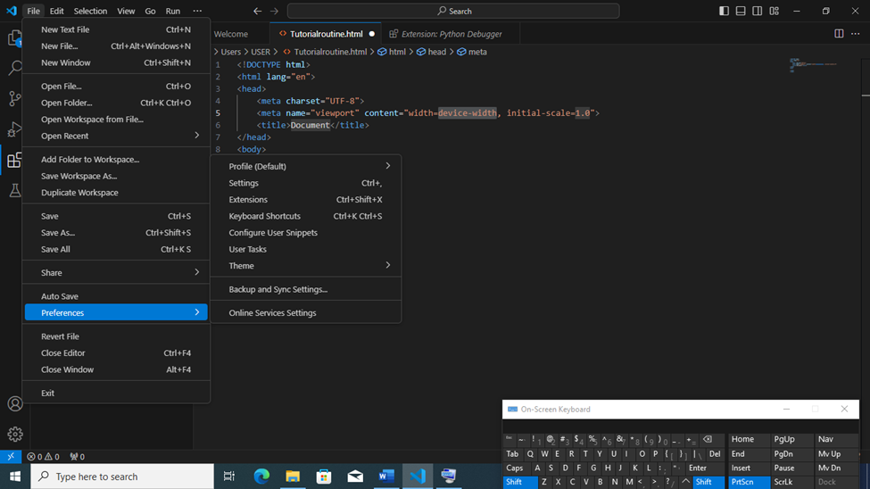

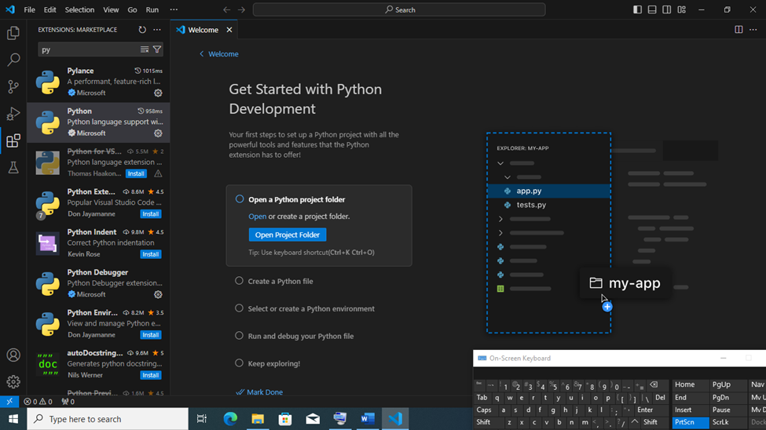


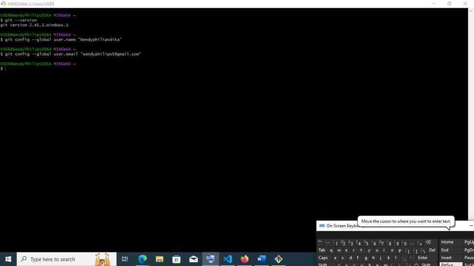

3. User Interface Overview:
   - Explain the main components of the VS Code user interface. Identify and describe the purpose of the Activity Bar, Side Bar, Editor Group, and Status Bar.

   Visual Studio Code (VS Code) has a user-friendly interface that consists of several key components. Understanding these components can help you navigate and use the editor more efficiently. Here are the main components of the VS Code interface:

1. Activity Bar

- Location: Left side of the screen.
- Functionality: Provides access to different views and primary functionalities of VS Code.
 - Explorer: View and manage your files and folders.
  - Search: Perform text searches across your workspace.
  - Source Control: Manage your source control (e.g., Git).
  - Run and Debug: Access debugging features.
  - Extensions: Install and manage VS Code extensions.

2. Side Bar

- Location: Adjacent to the Activity Bar.
- Functionality: Displays different views based on the selected activity from the Activity Bar.
  - Explorer View: Shows the file and folder structure of your workspace.
  - Search View: Displays search results.
  - Source Control View: Shows version control changes and history.
  - Run and Debug View: Lists debugging configurations and tools.
  - Extensions View: Allows browsing and installing extensions.

3. Editor Group

- Location: Center of the screen.
- Functionality: The primary area where you write and edit your code.
  - Tabs: Open multiple files in tabs at the top of the Editor Area.
  - Split Editors: Split the Editor Area to view and edit multiple files side by side.

 4. Status Bar

- Location: Bottom of the screen.
- Functionality: Provides information about the current state of the editor and the workspace.
  - Current Branch: Displays the current Git branch.
  - Errors and Warnings: Shows the number of errors and warnings.
  - Language Mode: Indicates the programming language of the currently open file.
  - Encoding: Shows the file encoding.
  - Line and Column Numbers: Displays the cursor's position in the file.
  - Spaces/Tab Size: Indicates whether spaces or tabs are used for indentation and their size.

5. Activity Bar (Outline)

- Location: Below the Activity Bar.
- Functionality: Provides a quick outline of the file's structure.
  - Symbols: Displays functions, classes, and other symbols in the current file.
  - Navigate: Quickly jump to different parts of the file.


By understanding these main components of the VS Code interface, you can better navigate and utilize the powerful features of the editor. This knowledge helps streamline your development process, making it easier to write, manage, and debug your code.


4. Command Palette:
   - What is the Command Palette in VS Code, and how can it be accessed? Provide examples of common tasks that can be performed using the Command Palette.

   The Command Palette in VS Code includes all shortcuts relevant to your current context. You can access it using a specific key combination: Linux and Windows share the same combination, while Mac uses a different one.

It is designed to streamline your workflow by providing a quick and easy way to execute commands without navigating through menus.

Key Features and Functions of the Command Palette:

1. Accessing Commands:
   - Provides access to all built-in commands and those added by extensions.
   - Allows you to perform tasks such as opening files, running scripts, managing extensions, changing settings, and more.

2. Quick Search and Navigation:
   - Enables you to search for and execute commands quickly.
   - Helps you navigate to specific files, symbols, or lines within your project.

3. Customization:
   - Allows you to customize settings and configurations directly from the Command Palette.
   - Lets you install, update, or uninstall extensions easily.

4. IntelliSense:
   - Offers intelligent suggestions as you type, helping you find the right command quickly.


 How to Access the Command Palette on Windows:


1.Lunch VS Code on your Windows 10 or 11 PC

2. Using Keyboard Shortcuts:
   - Press `Ctrl+Shift+P` to open the Command Palette.
   - Alternatively, pressing `F1` also opens the Command Palette.

3. Using the Menu Bar:
   - Click on `View` in the menu bar.
   - Select `Command Palette` from the dropdown menu.

 Examples of Common Commands:

1. Open a File:
   - Open the Command Palette (`Ctrl+Shift+P`), type `Open File`, and select the file you want to open.

2. Format Document:
   - Open the Command Palette, type `Format Document`, and press `Enter`.

3. Install Extensions:
   - Open the Command Palette, type `Extensions: Install Extensions`, and search for the desired extension to install.

4. Toggle Terminal:
   - Open the Command Palette, type `Toggle Terminal`, and press `Enter`.

5. Git Commands:
   - Open the Command Palette, type `Git:`, and see a list of available Git commands.


The Command Palette in VS Code on Windows is an indispensable tool for enhancing productivity. It provides a quick and intuitive way to access commands, settings, and files, allowing you to streamline your development workflow and focus more on coding.


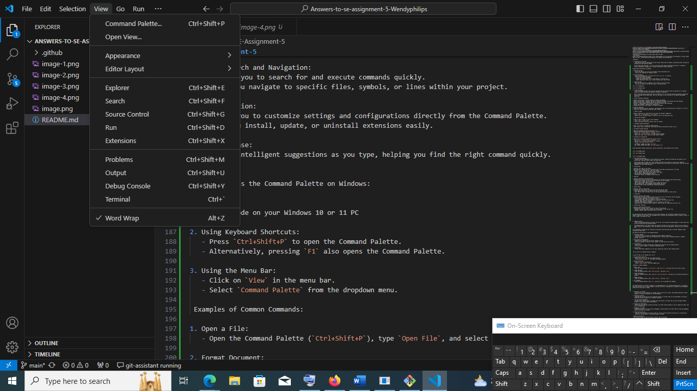

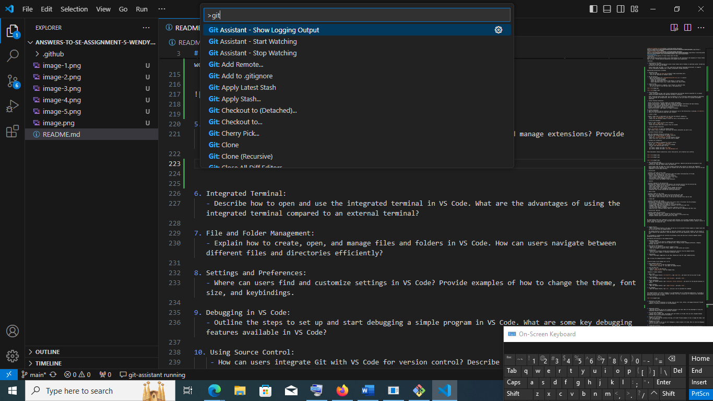


5. Extensions in VS Code:
   - Discuss the role of extensions in VS Code. How can users find, install, and manage extensions? Provide examples of essential extensions for web development.

Extensions are add-ons that let you customize and enhance your experience in Visual Studio by introducing new features or integrating existing tools. They vary in complexity, but their primary goal is to boost your productivity and support your workflow.

Here are the key roles and benefits of using extensions in VS Code:

1. Language Support

- Syntax Highlighting: Extensions add support for syntax highlighting for various programming languages, making code more readable and easier to debug.
  - Example: Python, JavaScript, Java, C#, and many other language-specific extensions.

- Code Completion: Language extensions provide IntelliSense and code completion features, helping developers write code faster and with fewer errors.
  - Example: Python extension, JavaScript (ES6) Code Snippets.

- Linting and Error Checking: Extensions can integrate linters that analyze code for potential errors and enforce coding standards.
  - Example: ESLint for JavaScript, Pylint for Python.

2. Development Tools

- Debugging: Extensions can add powerful debugging tools, allowing developers to set breakpoints, inspect variables, and step through code.
  - Example: Python extension, C/C++ extension.

- Version Control: Extensions enhance version control integration, providing features like GitLens for advanced Git capabilities.
  - Example: GitLens, GitHub Pull Requests and Issues.

- Code Formatting: Extensions help maintain consistent code formatting across a project.
  - Example: Prettier - Code formatter, Black for Python.

3. Productivity Enhancements

- Snippets: Code snippet extensions provide reusable templates for common code structures, reducing the amount of repetitive typing.
  - Example: ES7 React/Redux/GraphQL/React-Native snippets.

- Task Runners: Extensions can automate repetitive tasks, such as building, testing, and deploying code.
  - Example: Task Runner Explorer.

- Project Management: Extensions help manage projects and tasks within the editor.
  - Example: Project Manager, Todo Tree.

4. Customization and Theming

- Themes: Extensions allow users to customize the appearance of VS Code with various color themes and icon packs.
  - Example: One Dark Pro, Material Icon Theme.

- Customization Tools: Extensions can modify the behavior and appearance of VS Code to better suit individual workflows.
  - Example: Settings Sync for synchronizing settings across multiple devices.

5. Integration with External Services

- Cloud Services: Extensions integrate VS Code with cloud platforms and services, such as Azure, AWS, and Google Cloud.
  - Example: Azure Tools, AWS Toolkit.

- APIs and Libraries: Extensions provide integration with various APIs and libraries, simplifying the development process.
  - Example: REST Client for testing APIs, GraphQL for VS Code.

6. Educational Tools

- Learning Resources: Extensions offer tutorials, examples, and other educational content directly within the editor.
  - Example: Python VS Code Tutor, Quokka.js for live coding feedback.

- Interactive Coding: Extensions support interactive coding environments, such as Jupyter notebooks, for data science and educational purposes.
  - Example: Jupyter extension.

7. Collaboration

- Live Sharing: Extensions enable real-time collaboration on code, allowing multiple developers to work together seamlessly.
  - Example: Live Share.

- Code Review: Extensions facilitate code reviews and pull request management within VS Code.
  - Example: GitHub Pull Requests and Issues.


How Users Can Find, Install, and Manage Extensions in Visual Studio Code

Extensions are essential for enhancing the functionality of Visual Studio Code (VS Code). Here’s a detailed guide on how users can find, install, and manage extensions in VS Code.

Finding Extensions

1. Using the Extensions View

   - Open Extensions View: Click on the Extensions icon in the Activity Bar on the side of the window or use the keyboard shortcut `Ctrl+Shift+X`.

   - Search for Extensions: Use the search bar at the top of the Extensions view to search for specific extensions by name or functionality.

2. VS Code Marketplace

   - Visit Marketplace: You can browse extensions online by visiting the [Visual Studio Code Marketplace](https://marketplace.visualstudio.com/vscode).

   - Browse Categories: The marketplace allows you to browse extensions by categories such as programming languages, themes, tools, and more.

3. Recommended Extensions

   - Recommendations: VS Code provides recommendations based on the type of files you open or the current workspace settings.
   - View Recommendations: In the Extensions view, there is a section for recommended extensions.

Installing Extensions

1. Directly from VS Code

   - Search and Install: In the Extensions view (`Ctrl+Shift+X`), search for the desired extension. Click on the `Install` button next to the extension you want to install.
   - View Details: Clicking on an extension will open its detail page, where you can read more about its features and see user reviews before installing.


2. Using the Command Palette

   - Open Command Palette: Press `Ctrl+Shift+P` to open the Command Palette.
   - Install Extension: Type `ext install` followed by the name of the extension you want to install. For example, type `ext install ms-python.python` to install the Python extension.

Managing Extensions

1. View Installed Extensions

   - Extensions View: In the Extensions view, there is a section for installed extensions. Here, you can see all extensions currently installed in your VS Code.

2. Disable or Enable Extensions

   - Disabling: To disable an extension, click on the gear icon next to the extension and select `Disable`. You can choose to disable it for the current workspace or globally.
   - Enabling: To enable a previously disabled extension, follow the same steps and select `Enable`.

3. Uninstalling Extensions

   - Uninstalling: To uninstall an extension, click on the gear icon next to the extension in the Extensions view and select `Uninstall`.

4. Extension Settings

   - Configure Settings: Some extensions have additional settings that can be configured. Click on the gear icon next to the extension and select `Extension Settings`.
   - JSON Configuration: You can also configure extension settings through the `settings.json` file by accessing it from the Command Palette (`Ctrl+Shift+P`) and typing `Preferences: Open Settings (JSON)`.

5. Updates

   - Automatic Updates: Extensions are updated automatically by default. You can manage this setting in the VS Code settings.
   - Manual Updates: To manually check for updates, go to the Extensions view, click on the `...` (More Actions) button, and select `Check for Extension Updates`.


Extensions are vital in transforming VS Code into a versatile and powerful development environment tailored to individual needs. They enhance language support, improve productivity, integrate external tools and services, and offer extensive customization options. By leveraging extensions, developers can significantly enhance their coding experience, streamline workflows, and collaborate more effectively.


Examples of Essential Extensions for Web Development in Visual Studio Code :

Visual Studio Code (VS Code) offers a wide range of extensions that can significantly enhance your web development experience. Here are some essential extensions for web development, covering various aspects such as coding efficiency, debugging, and workflow improvements:

1. Language Support Extensions**

- ESLint:
  - Ensures code quality by identifying and fixing JavaScript code errors.
  
- Prettier - Code formatter:
  - Automatically formats your code to ensure consistent style across your project.

- JavaScript (ES6) code snippets:
  - Provides snippets for JavaScript, including ES6 syntax.

- HTML Snippets:
  - Offers a wide range of HTML snippets to speed up your coding.

- CSS IntelliSense:
  - Provides CSS class name completion from defined stylesheets, making styling more efficient.

2. Framework and Library Support

- Vue.js Extension Pack: 
  - A collection of essential extensions for working with Vue.js, including Vetur, ESLint, and Prettier.

- React Extension Pack: 
  - Provides React, Redux, and React Native snippets and IntelliSense.

- Tailwind CSS IntelliSense:
  - Enhances Tailwind CSS workflow with autocomplete, linting, and hover preview features.

3. Debugging and Testing:

- Debugger for Chrome: 
  - Enables debugging JavaScript code running in the Chrome browser.

- Live Server: 
  - Launches a local development server with live reload feature for static and dynamic pages.

- Jest: 
  - Provides Jest support for running and debugging JavaScript tests.

4. Version Control and Collaboration:


- GitHub Pull Requests and Issues:
  - Allows you to manage GitHub pull requests and issues directly from VS Code.

- Live Share: 
  - Enables real-time collaborative coding with other developers.

5. Productivity and Utilities

- Path Intellisense: 
  - Autocompletes filenames, making it easier to include and link files in your project.

- Auto Rename Tag: 
  - Automatically renames paired HTML/XML tags, ensuring consistency.

- Bracket Pair Colorizer:
  - Colorizes matching brackets to make it easier to identify matching pairs.

6. Theming and Customization

- One Dark Pro:
  - A popular dark theme that makes the interface visually appealing and easy on the eyes.

- Material Icon Theme: 
  - Provides a comprehensive set of icons to make your project files more recognizable.


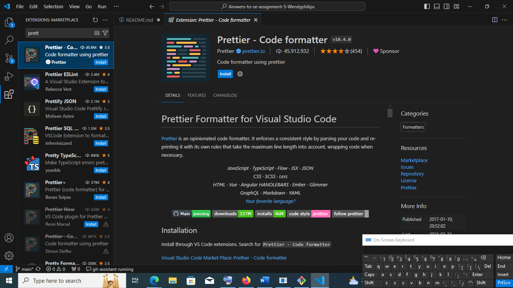

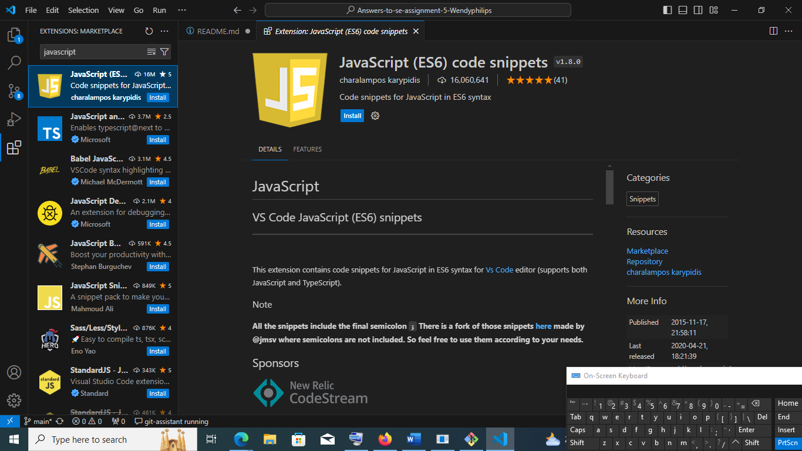

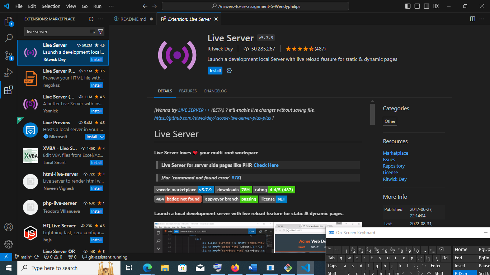

These extensions cover a broad range of functionalities, ensuring you have the tools needed for efficient and effective web development.


6. Integrated Terminal:
   - Describe how to open and use the integrated terminal in VS Code. What are the advantages of using the integrated terminal compared to an external terminal?


   How to Open and Use the Integrated Terminal in Visual Studio Code

The Integrated Terminal in Visual Studio Code (VS Code) is a powerful feature that allows you to run command-line applications and scripts directly within the editor. This can significantly enhance your development workflow by reducing the need to switch between different windows or applications. Here's how to open and use the Integrated Terminal in VS Code:

Opening the Integrated Terminal

1. Using the Menu Bar:
   - Go to the top menu bar.
   - Click on `View`.
   - Select `Terminal` from the dropdown menu.
   
2. Using Keyboard Shortcuts:
   - Press `Ctrl + ` (backtick) on your keyboard.
   - Alternatively, press `Ctrl + Shift + ` to open a new terminal if one is already open.

3. Using the Command Palette:
   - Press `Ctrl + Shift + P` to open the Command Palette.
   - Type `View: Toggle Integrated Terminal` and select it.

Using the Integrated Terminal

1. Basic Terminal Operations:
   - Run Commands: Type any command you would normally run in a command-line interface (CLI) and press `Enter`. For example, you can run `dir` on Windows or `ls` on Unix-based systems to list directory contents.

   - Clear Terminal: Type `clear` and press `Enter` to clear the terminal output. Alternatively, use `Ctrl + L`.

2. Managing Multiple Terminals:
   - New Terminal: To open a new terminal instance, click the `+` icon in the terminal panel or use the keyboard shortcut `Ctrl + Shift + `.
   - Switch Between Terminals:If you have multiple terminals open, you can switch between them by clicking on the tab corresponding to each terminal instance at the top of the terminal panel.
   - Rename Terminal: Right-click on the terminal tab and select `Rename` to give a terminal instance a custom name.

3. Terminal Configuration:
   - Change Default Shell: By default, VS Code uses your system's default shell. You can change this by going to `File > Preferences > Settings`, searching for `terminal.integrated.shell.windows`, and setting it to your preferred shell (e.g., PowerShell, Git Bash, etc.).

   - Split Terminal: You can split the terminal panel to run multiple terminals side by side by clicking the split icon in the terminal panel or using the keyboard shortcut `Ctrl + \`.

4. Integrated Terminal Settings:
   - Persistent Terminal Sessions: Terminal sessions can be preserved between VS Code restarts. Go to `File > Preferences > Settings` and search for `terminal.integrated.persistentSessions` to enable this feature.

   - Custom Profiles: You can define custom terminal profiles for different shells or command-line tools. Go to `File > Preferences > Settings` and search for `terminal.integrated.profiles.windows` to add custom profiles.

Example Commands

1. Navigating Directories:
   - Change directory: `cd path/to/directory`
   - List directory contents: `dir` (Windows) or `ls` (Unix-based systems)

2. Running Scripts:
   - Python script: `python script.py`
   - Node.js script: `node script.js`

3. Version Control:
   - Git status: `git status`
   - Commit changes: `git commit -m "commit message"`


Advantages of Using the Integrated Terminal Compared to an External Terminal

Using the Integrated Terminal in Visual Studio Code (VS Code) offers several advantages over using an external terminal. Here are some key benefits:

1. Convenience and Workflow Efficiency

- Single Environment: Having the terminal integrated within the same window as your code editor allows you to stay in a single environment, reducing the need to switch between multiple applications.

- Seamless Workflow: You can easily run commands, execute scripts, and see results without leaving VS Code, which streamlines your development process and increases productivity.

2. Context Awareness

- Project Context: The Integrated Terminal is aware of the current project context. It automatically opens in the root directory of your workspace, ensuring that any commands you run are executed in the correct context.

- Immediate Feedback: Seeing terminal output and code side by side allows for immediate feedback and quicker debugging and development cycles.

3. Configuration and Customization

- Custom Profiles: You can define custom terminal profiles to suit different development needs (e.g., different shells, virtual environments). This level of customization is often more seamlessly integrated within VS Code.

- Persistent Sessions: The Integrated Terminal can preserve terminal sessions between restarts, allowing you to pick up where you left off without re-running setup commands.

4. Enhanced Features

- Terminal Grouping and Splitting: You can create multiple terminal instances and split them within the VS Code window, making it easy to run multiple commands concurrently and monitor different outputs simultaneously.

- Theming and Styling: The Integrated Terminal inherits VS Code’s themes and styling, ensuring a consistent visual experience across your coding and command-line tasks.

5. Built-in Tools and Extensions

- Extension Integration: Many VS Code extensions leverage the Integrated Terminal to provide additional functionalities (e.g., linting, testing, deployment commands). This tight integration can enhance your development workflow.

- Task Runner: VS Code’s Task Runner can execute tasks directly in the Integrated Terminal, allowing for automated build and deployment processes within the same interface.

 6. Productivity Enhancements

- Keyboard Shortcuts: VS Code provides keyboard shortcuts for quickly opening, closing, and navigating between terminals, making command execution faster and more efficient.

- Intellisense: In some scenarios, the Integrated Terminal can leverage VS Code’s IntelliSense capabilities, offering command suggestions and autocompletion for a smoother experience.

 7. Version Control Integration

- Git Integration: The Integrated Terminal works seamlessly with VS Code’s Git integration, making it easier to run Git commands while working with the source control features provided by the editor.

- Collaborative Tools: Extensions like Live Share allow collaborative coding with terminal access, making it easier to share and review command-line tasks with team members.


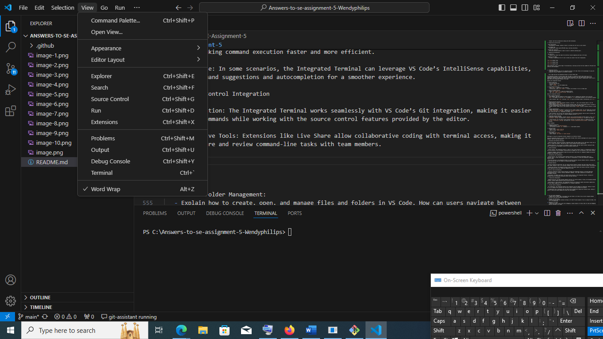


7. File and Folder Management:
   - Explain how to create, open, and manage files and folders in VS Code. How can users navigate between different files and directories efficiently?

Creating, Opening, and Managing Files and Folders in Visual Studio Code (VS Code)

Navigating between different files and directories efficiently in Visual Studio Code (VS Code) on Windows can be achieved using several built-in navigation features and keyboard shortcuts. Here’s how you can do it:

1. Using the Explorer View

 Opening Files and Directories

- Explorer Icon: Click on the Explorer icon in the Activity Bar on the side of the window (or use `Ctrl+Shift+E`).
- Double-click: Double-click on a file or folder in the Explorer view to open it in the editor.

Creating New Files and Directories

- Right-click: Right-click on a folder in the Explorer view.
- Select New File/Folder: Choose `New File` or `New Folder` to create a new file or folder respectively.

2. Using the Command Palette

Opening Files

- Ctrl+P: Press `Ctrl+P` to open the Quick Open dialog.
- Type file name: Type the name of the file you want to open. VS Code provides suggestions as you type.
- Enter: Press `Enter` to open the selected file.

Creating New Files and Directories

- Ctrl+Shift+P: Press `Ctrl+Shift+P` to open the Command Palette.
- Type and select: Type `File: New File` and press `Enter` to create a new file. Similarly, type `File: New Folder` and press `Enter` to create a new folder.

3. Using Keyboard Shortcuts

File Navigation

- Ctrl+Tab: Cycle through open files.
- Ctrl+Number: Switch to a specific tab number (e.g., `Ctrl+1` for the first tab).
- Ctrl+Page Up / Ctrl+Page Down: Navigate to the previous or next open editor tab.

Directory Navigation

- Ctrl+\: Toggle focus between the editor and Explorer view.
- Alt+Left / Alt+Right: Navigate backward or forward through open editors (like browser navigation).

4. Working with Multiple Files

Splitting Editors

- Split Editor: Click on the `Split Editor` button in the top-right corner of an open editor tab to split it vertically or horizontally.

Tabs

- Tab Navigation: Each open file is represented as a tab at the top of the editor. Click on a tab to switch between open files.


Efficient navigation between files and directories in Visual Studio Code on Windows involves utilizing the Explorer view, Command Palette, and keyboard shortcuts. These features enable you to quickly open, create, and manage files and folders within your project, enhancing your productivity as a developer. By mastering these navigation techniques, you can streamline your workflow and focus more on coding and less on managing files.


8. Settings and Preferences:
   - Where can users find and customize settings in VS Code? Provide examples of how to change the theme, font size, and keybindings.

VS Code offers a comprehensive settings interface that allows users to customize their development environment to suit their preferences. Here's how you can find and customize these settings:

1. Accessing Setting

There are multiple ways to access the settings in VS Code:

- Using the Menu Bar:
  - Go to `File` > `Preferences` > `Settings`.
  - Alternatively, go to `Code` > `Preferences` > `Settings` on some systems.

- Using Keyboard Shortcuts:
  - Press `Ctrl+,` to open the Settings directly.

- Using the Command Palette:
  - Press `Ctrl+Shift+P` to open the Command Palette.
  - Type `Preferences: Open Settings` and select it.

 2. Navigating the Settings Interface

The Settings interface in VS Code is divided into two main views:

- User Settings: These settings apply to all VS Code instances on your machine.
- **Workspace Settings**: These settings are specific to the project or workspace you have open.

You can switch between these views using the tabs at the top of the Settings editor.

3. Customizing Settings

Settings in VS Code can be customized through the GUI or by editing the JSON configuration files.

Using the GUI

- Search for Settings: Use the search bar at the top of the Settings editor to quickly find the setting you want to customize.
- Modify Settings: Toggle switches, check/uncheck boxes, or select options from dropdown menus to change settings.

Using JSON Configuration Files

For more advanced customization, you can edit the settings JSON files directly:

- Open Settings JSON:
  - Click on the `{}` icon at the top right of the Settings editor.
  - Alternatively, you can use the Command Palette (`Ctrl+Shift+P`), type `Preferences: Open Settings (JSON)`, and select it.

- Edit JSON:
  - Add or modify settings using JSON syntax. For example:
    ```json
    {
      "editor.fontSize": 14,
      "editor.tabSize": 4,
      "files.autoSave": "afterDelay"
    }
    ```

How to change the theme, font size and key binding.

Here are some commonly customized settings and how to adjust them:

1. Accessing Font Size Settings

There are multiple ways to access the font size settings in VS Code:

- Using the Menu Bar:
  - Go to `File` > `Preferences` > `Settings`.
  - Alternatively, go to `Code` > `Preferences` > `Settings` on some systems.

- Using Keyboard Shortcuts:
  - Press `Ctrl+,` to open the Settings directly.

- Using the Command Palette:
  - Press `Ctrl+Shift+P` to open the Command Palette.
  - Type `Preferences: Open Settings` and select it.


2. Accessing Theme Settings

There are several ways to access and change theme settings in VS Code:

- Using the Menu Bar:
  - Go to `File` > `Preferences` > `Color Theme`.
  - Alternatively, go to `Code` > `Preferences` > `Color Theme` on some systems.

- Using Keyboard Shortcuts:
  - Press `Ctrl+K Ctrl+T` to open the Color Theme picker directly.

- Using the Command Palette:
  - Press `Ctrl+Shift+P` to open the Command Palette.
  - Type `Preferences: Color Theme` and select it.


3. Accessing Key Bindings

There are multiple ways to access the key bindings settings in VS Code:

- Using the Menu Bar:
  - Go to `File` > `Preferences` > `Keyboard Shortcuts`.
  - Alternatively, go to `Code` > `Preferences` > `Keyboard Shortcuts` on some systems.

- Using Keyboard Shortcuts:
  - Press `Ctrl+K Ctrl+S` to open the Keyboard Shortcuts editor directly.

- Using the Command Palette:
  - Press `Ctrl+Shift+P` to open the Command Palette.
  - Type `Preferences: Open Keyboard Shortcuts` and select it.


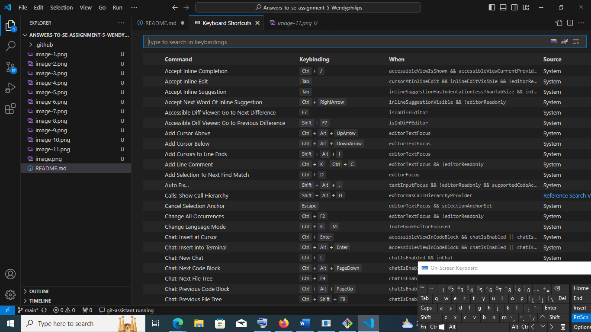


9. Debugging in VS Code:
   - Outline the steps to set up and start debugging a simple program in VS Code. What are some key debugging features available in VS Code?

Debugging in Visual Studio Code (VS Code) for Windows and some key debugging features available in Vs Code.

Debugging is an essential part of software development, allowing developers to inspect and control the execution of their programs to find and fix bugs. Visual Studio Code (VS Code) offers a powerful and flexible debugging environment. Here’s how you can effectively use the debugging features in VS Code on Windows:

1. Setting Up the Debug Environment

Before you start debugging, you need to set up your project to support debugging.

- Open Your Project:
  - Launch VS Code and open the project folder you want to debug.

- Install Necessary Extensions:
  - Depending on the language you're using, you may need to install specific extensions. For example, for JavaScript/TypeScript, you might want to install the Node.js extension; for Python, the Python extension; for C++, the C++ extension, etc.

2. Creating a Debug Configuration

VS Code uses a configuration file (`launch.json`) to define the debug settings.

1. Open the Debug View:
   - Click on the Debug icon in the Activity Bar on the side of the window, or press `Ctrl+Shift+D`.

2. Create a Launch Configuration:
   - Click on the gear icon to open the `launch.json` file. If it’s your first time setting up debugging for this project, VS Code will prompt you to select the environment (e.g., Node.js, Python, etc.).

3. Configure `launch.json`:
   - VS Code will generate a basic `launch.json` file. You can customize this file according to your debugging needs. For example, a simple configuration for Node.js might look like this:
     ```json
     {
       "version": "0.2.0",
       "configurations": [
         {
           "type": "node",
           "request": "launch",
           "name": "Launch Program",
           "program": "${workspaceFolder}/app.js"
         }
       ]
     }
     ```

3. Setting Breakpoints

Breakpoints allow you to pause the execution of your program at specific points to inspect variables, evaluate expressions, and control execution flow.

- Add a Breakpoint:
  - Open the file where you want to set a breakpoint.
  - Click on the left margin next to the line number where you want to set the breakpoint, or press `F9` with the cursor on the desired line.

- View and Manage Breakpoints:
  - In the Debug view, you can see all the breakpoints you have set. You can enable, disable, or remove breakpoints from here.

4. Starting a Debugging Session

1. Launch the Debugger:
   - Go to the Debug view (`Ctrl+Shift+D`).
   - Select the appropriate configuration from the dropdown menu.
   - Click the green play button or press `F5` to start debugging.

2. Control Execution:
   - Continue (F5): Continue running the program until the next breakpoint or the end of the program.
   - Step Over (F10): Execute the next line of code, but don’t step into functions.
   - Step Into (F11): Step into functions to debug inside them.
   - Step Out (Shift+F11): Step out of the current function.
   - Restart (Ctrl+Shift+F5): Restart the debugging session.
   - Stop (Shift+F5): Stop the debugging session.

5. Inspecting Variables and Expressions

While debugging, you can inspect variables and evaluate expressions to understand the state of your program.

- Variables Pane:
  - In the Debug view, the Variables pane shows all the variables in the current scope. You can expand objects and arrays to see their properties.

- Watch Expressions:
  - You can add expressions to the Watch pane to evaluate them at every breakpoint. Right-click in the Watch pane and select "Add Expression," then type the expression you want to watch.

- Call Stack:
  - The Call Stack pane shows the stack of function calls leading to the current point in execution. You can click on any frame to view its context.

- Breakpoints Pane:
  - Manage all your breakpoints, including conditional breakpoints, in the Breakpoints pane.

6. Using the Debug Console

The Debug Console allows you to interact with the program while it’s paused at a breakpoint.

- Evaluate Expressions:
  - Type any expression in the Debug Console to evaluate it in the current context.
  
- Execute Commands:
  - You can also execute commands and inspect their results directly in the console.

Debugging in Visual Studio Code on Windows is a powerful way to find and fix issues in other to improve your program. 


10. Using Source Control:
    - How can users integrate Git with VS Code for version control? Describe the process of initializing a repository, making commits, and pushing changes to GitHub.


Integrating Git with Visual Studio Code (VS Code) for Version Control

Visual Studio Code (VS Code) has excellent integration with Git, making it a powerful tool for version control. Here’s a detailed guide on how to set up and use Git with VS Code on a Windows operating system:

1. Installing Git

Before integrating Git with VS Code, you need to install Git on your system.

1. Download Git;
   - Go to the [Git website](https://git-scm.com/) and download the installer for Windows.

2. Run the Installer:
   - Open the downloaded `.exe` file and follow the installation prompts. You can keep the default settings unless you have specific preferences.

3. Verify Installation:
   - Open a terminal (Command Prompt or PowerShell) and type:
     ```bash
     git --version
     ```
   - You should see the installed Git version, confirming the installation was successful.

2. Setting Up Git in VS Code

1. Open VS Code:
   - Launch VS Code on your Windows system.

2. Open the Source Control View:
   - Click on the Source Control icon in the Activity Bar on the side of the window, or press `Ctrl+Shift+G`.

3. Initialize a Repository:
   - If you don't have a Git repository initialized, you can create one by clicking on `Initialize Repository` in the Source Control view.

4. Open a Folder:
   - Open a folder that contains your project or create a new one by going to `File` > `Open Folder`.

3. Cloning a Repository

1. Open the Command Palette:
   - Press `Ctrl+Shift+P` to open the Command Palette.

2. Clone Repository:
   - Type `Git: Clone` and select the `Git: Clone` command.
   - Enter the repository URL you want to clone and select the folder where you want to clone it.

3. Open the Cloned Repository:
   - After cloning, VS Code will ask if you want to open the cloned repository. Click `Open`.

4. Configuring Git

1. Set User Name and Email:
   - Open the terminal in VS Code by going to `View` > `Terminal` or pressing ``Ctrl+` ``.
   - Configure your Git user name and email:
     ```bash
     git config --global user.name "Your Name"
     git config --global user.email "youremail@example.com"
     ```

2. Check Configuration:
   - Verify your configuration:
     ```bash
     git config --global --list
     ```

5. Using Git in VS Code

1. Staging Changes:
   - In the Source Control view, you will see a list of changes. Click on the `+` icon next to each file to stage the changes, or click the `+` icon in the `Changes` header to stage all changes.

2. Committing Changes:
   - Enter a commit message in the input box at the top of the Source Control view.
   - Click on the checkmark icon or press `Ctrl+Enter` to commit the staged changes.

3. Pushing and Pulling Changes:
   - Click on the `...` (ellipsis) icon in the Source Control view to open the Git menu.
   - Select `Push` to upload your commits to the remote repository, or `Pull` to fetch and merge changes from the remote repository.


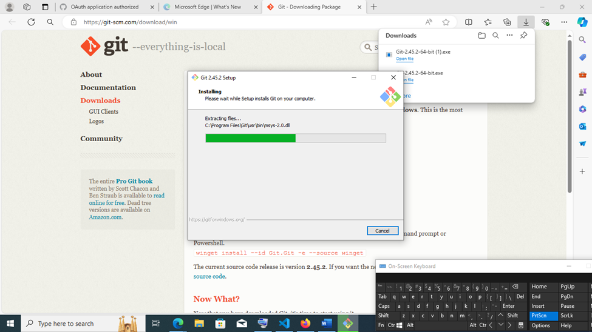


clear
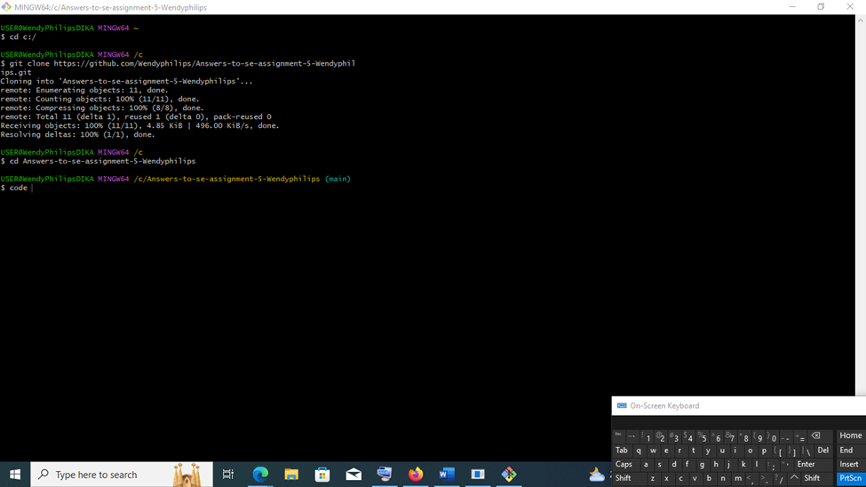


By following these steps, a user can set up, configure, and utilize Git features directly in VS Code, enabling efficient source control management. 

References:

1. chat gpt
2. Alphrhttps://alphr.com>open-co...How to Open the Command Palette in VS Code
3. User and Workspace Setting-Visual Studio Code 


 Submission Guidelines:
- Your answers should be well-structured, concise, and to the point.
- Provide screenshots or step-by-step instructions where applicable.
- Cite any references or sources you use in your answers.
- Submit your completed assignment by 1st July 

